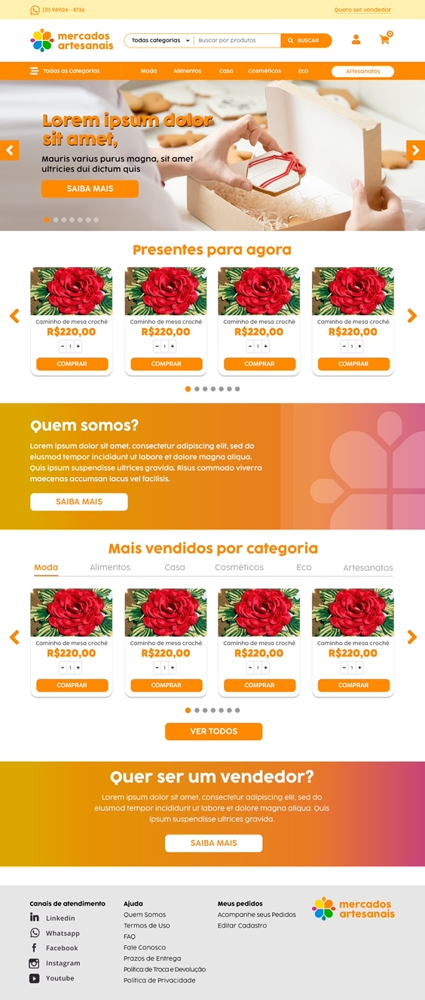

# Mercados-Artesanais

Este Desafio foi feito para vaga de desenvolvedor front-end Jr na empresa Tamppa E-commerce

## Recursos

* O Desafio exige responsividade, clean code, arquiterura bem estruturada, semântica, sintaxe e acessibilidade.
* O Desafio foi desenvolvido com JavaScript, CSS e HTML e BootStrap.

## Uso

1. Clone o repositório do GitHub.
2. Abra o projeto no seu editor de código.
3. Abra o arquivo index.html (Página estática).

## Créditos

Este projeto foi criado por Alaska Websites.
